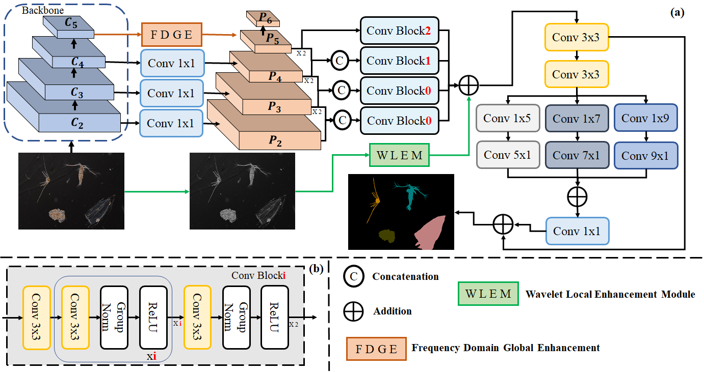

# ZS2Net: Frequency-Aware Semantic Segmentation for Zooplankton Microscopic Images

> **Published in:** Expert Systems With Applications (ESWA), 2026

## Overview

ZS2Net is a frequency-aware semantic segmentation network designed for zooplankton microscopic image analysis. It addresses the challenge of segmenting morphologically similar zooplankton species by integrating frequency-domain processing directly into the segmentation pipeline.

The network introduces three core modules:

- **tDFFT** (Trainable Dynamic Fast Fourier Transform) — applies learnable spectral filters in the Fourier domain with dynamic group convolutions and position encoding to capture global frequency patterns.
- **tDWT** (Trainable Discrete Wavelet Transform) — decomposes input images via Haar wavelet into approximation and detail sub-bands (cA, cH, cV, cD), enhanced with a Channel Attention Module (CAM) for frequency-aware feature reweighting.
- **EEM** (Edge Enhancement Module) — multi-scale depthwise convolutions with kernels of size 5, 7, and 9 to sharpen boundary-level representations before final classification.

The decoder follows a top-down FPN-style architecture with multi-scale feature fusion from ResNet50 stages (C2–C5), where high-level features processed by tDFFT guide lower-level detail recovery.



## Dataset: ZMI2K

ZS2Net is evaluated on **ZMI2K**, a zooplankton microscopic image dataset formatted in COCO annotation style with **39 categories** (1 background + 38 species).

<details>
<summary>Full class list (39 categories)</summary>

| Index | Class Name |
|-------|-----------|
| 0 | _background_ |
| 1 | Calanus sinicus |
| 2 | Sagitta crassa |
| 3 | Themisto gracilipes |
| 4 | Penilia avirostris |
| 5 | Centropages abdominalis |
| 6 | Acartia pacifica |
| 7 | Centropages tenuiremis |
| 8 | Pontellopsis tenuicauda |
| 9 | Calanopia thompsoni |
| 10 | Sugiura chengshanense |
| 11 | Ophioplutues larva early |
| 12 | Eirene menoni |
| 13 | Euphausia pacifica |
| 14 | Evadne tergestina |
| 15 | Muggiaea atlantica |
| 16 | Paracalanus parvus |
| 17 | Oithona plumifera |
| 18 | Pleurobrachia globosa |
| 19 | Clytia folleata |
| 20 | Obelia dichotoma |
| 21 | Ectopleura bimanatus |
| 22 | Doliolum denticulatum |
| 23 | Oikopleura longicauda |
| 24 | Tornaria larva |
| 25 | Polychaeta larva early |
| 26 | Polychaeta larva later |
| 27 | Turritopsis nutricula |
| 28 | Proboscidactyla flavicirrata |
| 29 | Fritillaria formica |
| 30 | Labidocera rotunda |
| 31 | Alima larva |
| 32 | Megalopa larva |
| 33 | Brachyura zoea larva |
| 34 | Ophioplutues larva later |
| 35 | Fish eggs |
| 36 | Fish larva |
| 37 | Actinotrocha larva |
| 38 | Trochophora larva |

</details>

Dataset directory structure (COCO format):

```
Datasets/
└── ZMI2K/
    └── COCO2017/
        ├── images/
        │   ├── train2017/
        │   └── val2017/
        └── annotations/
            ├── instances_train2017.json
            └── instances_val2017.json
```

## Requirements

```
torch >= 1.10
torchvision
einops
pywavelets (pywt)
pycocotools
albumentations
pytorch-warmup
thop
tabulate
wcwidth
tensorboard
tqdm
```

Install dependencies:

```bash
pip install torch torchvision einops PyWavelets pycocotools albumentations pytorch-warmup thop tabulate wcwidth tensorboard tqdm
```

## Training

```bash
python train.py \
  --model ZS2Net \
  --dataset zooplankton \
  --data_path ./Datasets/ZMI2K/COCO2017 \
  --num_class 39 \
  --epochs 600 \
  --batch_size 32 \
  --lr 1e-4 \
  --optimizer AdamW \
  --pretrained True \
  --base_size 224 \
  --out_dir ./output
```

Key arguments:

| Argument | Default | Description |
|----------|---------|-------------|
| `--model` | `ZPSSNets` | Model name: `ZS2Net`, `FCNs`, `UNet`, `DeepLabv3plus`, `PSPNets`, `FPNs`, `OCRNet` |
| `--num_class` | `39` | Number of segmentation classes |
| `--epochs` | `600` | Training epochs |
| `--batch_size` | `32` | Batch size |
| `--lr` | `1e-4` | Initial learning rate |
| `--optimizer` | `AdamW` | Optimizer: `Adam`, `SGD`, `AdamW` |
| `--pretrained` | `True` | Use ImageNet-pretrained ResNet50 backbone |
| `--base_size` | `224` | Input image size |
| `--seed` | `240703` | Random seed for reproducibility |

Training uses **CosineAnnealingLR** with **linear warmup**, and logs metrics to TensorBoard under `./run/`.

## Evaluation

```bash
python test.py \
  --model ZPSSNets \
  --dataset zooplankton \
  --data_path ./Datasets/ZMI2K/COCO2017 \
  --num_class 39 \
  --state val \
  --out_dir ./output \
  --save_dir ./output
```

Evaluation reports three metrics:
- **PA** — Pixel Accuracy
- **mIoU** — mean Intersection over Union
- **bIoU** — Boundary IoU (dilation ratio 0.005)

## Baseline Comparisons

ZS2Net is benchmarked against the following segmentation models, all trained under identical settings on ZMI2K:

| Model | Backbone |
|-------|----------|
| FCN | VGG |
| UNet | — |
| DeepLabv3+ | ResNet |
| PSPNet | ResNet101 |
| FPN | ResNet |
| OCRNet | HRNet |
| **ZS2Net (Ours)** | **ResNet50** |


## Citation

If you use ZS2Net or the ZMI2K dataset in your research, please cite:

```bibtex
@article{ZS2Net2026,
  title   = {ZS2Net: Frequency-aware semantic segmentation for zooplankton microscopic image},
  author = {Dekun Yuan and Zhongwei Li and Leiquan Wang and Yanping Qi and Zheng Qiao and Jie Zhang},
  journal = {Expert Systems With Applications},
  volume = {319},
  pages = {132072},
  issn = {0957-4174},
  doi = {10.1016/j.eswa.2026.132072},
  year    = {2026}
}
```

## License

This project is released for academic research purposes.
